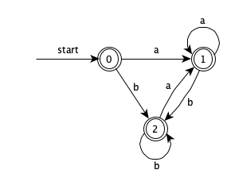
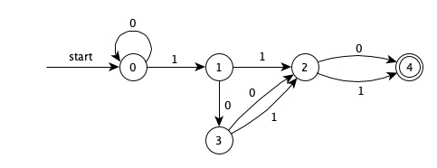

# 9.9
Chap2 2.1e;2.2;2.3e;2.4a,f,i;
## 2.1e:

## 2.2:
long--><long>  
gcd--><id,指向符号表中gcd条目的指针>  
long--><long>  
p--><id,指向符号表中p条目的指针>  
long--><long>  
q--><id,指向符号表中q条目的指针>  
if--><if>  
p--><id,指向符号表中p条目的指针>  
%--><modulo_op>  
q--><id,指向符号表中q条目的指针>  
==--><relation,EQ>  
0--><number,0>  
return--><return>  
q--><id,指向符号表中q条目的指针>  
else--><else>  
return--><return>  
gcd--><id,指向符号表中gcd条目的指针>  
q--><id,指向符号表中q条目的指针>  
p--><id,指向符号表中p条目的指针>  
%--><modulo_op>  
q--><id,指向符号表中q条目的指针>  

## 2.3e:
正规式所描述的语言：由偶数个“1”和偶数个“0”组成的0、1串集  

## 2.4a:
letterlow-->B|C|D|F|G|H|J|K|L|M|N|P|Q|R|S|T|V|W|X|Y|Z  
letterup-->b|c|d|f|g|h|j|k|l|m|n|p|q|r|s|t|v|w|x|y|z  
letter-->letterlow|letterup  
string-->letter\*(A|a)letter\*(E|e)letter\*(I|i)letter\*(O|o)letter\*(U|u)letter\*  

## 2.4f:
even01-->(00|11)\*  
odd01-->(10|01)  
language-->even01(odd01 even01 odd01 even01)\*  

## 2.4i
begb-->b\*  
mida-->(ab+)\*  
enda-->a?  
language-->begb mida enda  

# 9.11
9.11:Chap2 2.7c;2.11;2.15;

## 2.7c:
  
ababbab  
0>1>4>5>6>7>8>9>1>4>5>6>7>8>7>8>9>1>4>5>6>7>8>9>10  

## 2.11
由题意，易画出三者的最简DFA均为下图所示  
  

## 2.15

