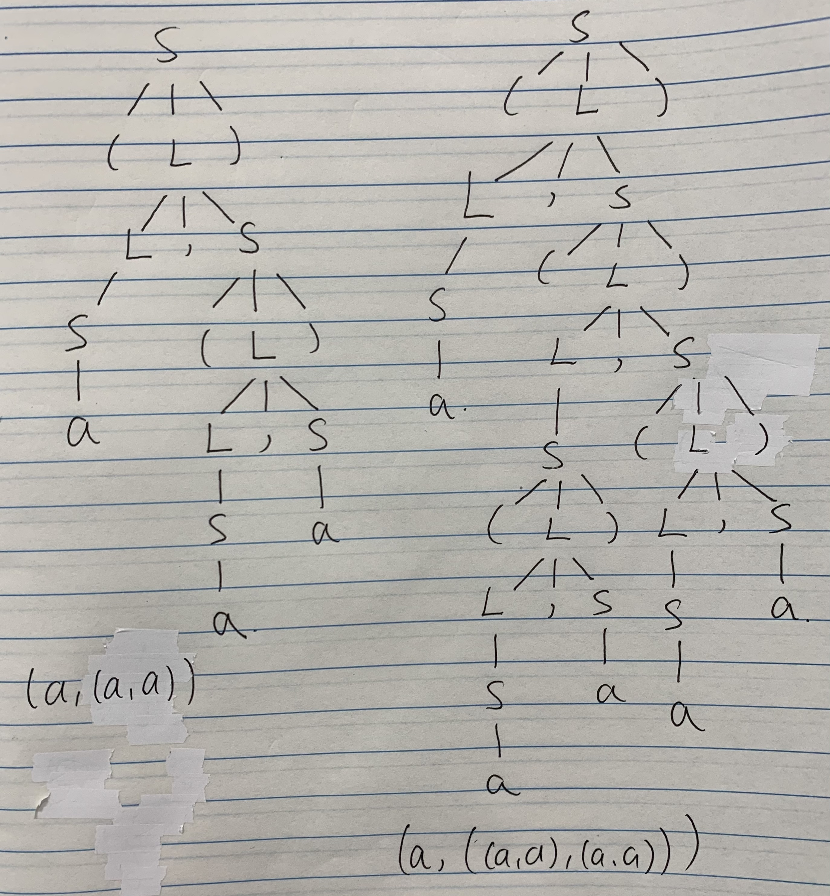
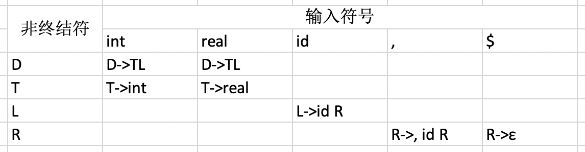
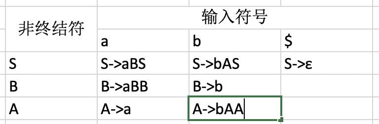

# 9.16
Chap3 3.1a、b; 3.6b、c;

## 3.1a
  
  
## 3.1b
S=>(L)=>(L,S)=>(S,S)=>(a,S)=>(a,(L))=>(a,(L,S))=>(a,(S,S))=>(a,(a,S))=>(a,(a,a))  
  
S=>(L)=>(L,S)=>(S,S)=>(a,S)=>(a,(L))=>(a,(L,S))=>(a,(S,S))=>(a,((L),S))=>(a,((L,S),S))=>(a,((S,S),S))=>(a,((a,S),S))=>(a,((a,a),S))=>(a,((a,a),(L)))=>(a,((a,a),(L,S)))=>(a,((a,a),(S,S)))=>(a,((a,a),(a,S)))=>(a,((a,a),(a,a)))  
## 3.6b
S->SS|aSb|bSa|ε  
不正规  

## 3.6c
E-ab个数相等的字符串
E->SS|aSb|bSa|ε  
A->E|AaA
B->E|BbB
final->AaA|BbB  
不正规  

# 9.18
Chap3 3.8,3.10,3.11,3.12  

## 3.8
(a)  
S->(L)|a  
L->S,L|S  

(b)  
可以利用分析表来构造预测分析器
FIRST(S)=FITST(L){"(","a"}
FOLLOW(S)={","}  
FOLLOW(L)={")"}  

## 3.10
FIRST(D)=FIRST(T)={"int","real"}  
FIRST(L)={"id"}  
FIRST(R)={",","ε"}  
FOLLOW(D)=FOLLOW(L)=FOLLOW(R)={"$"}  
FOLLOW(T)={"id"}
  

## 3.11
FIRST(S)={"a","b","ε"}  
FIRST(A)={"a","b"}  
FIRST(B)={"a","b"}  
FOLLOW(S)={"$"}  
FOLLOW(A)={"a","b","$"}
FOLLOW(B)={"a","b","$"}  
  

## 3.12
该文法不是LL(1)文法。 
因为FIRST(AB)与FIRST(PQx)的交集不为空，有公共元素x，不满足LL(1)文法的定义

