# 9.23
Chap3 3.16
## 3.16
(a)  
最右推导：  
S->*(L)*->(*L,S*)->(L,*(L)*)->(L,(*L,S*))->(L,(L,*a*))-> 
(L,(*S*,a))->(L,(*a*,a))->(*S*,(a,a))->(*a*,(a,a))  
粗体即位句柄
(b)  
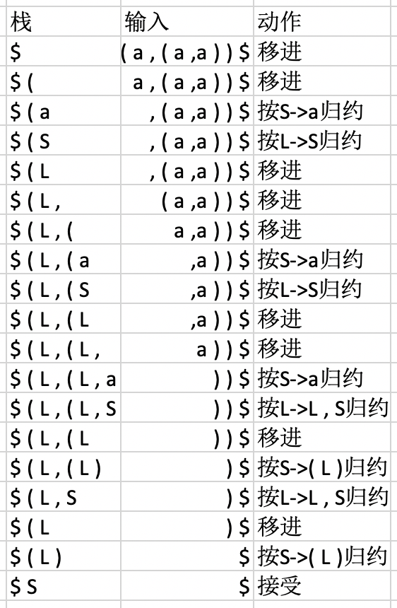  
(c) 
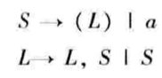  
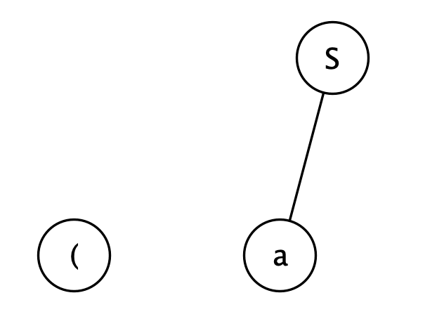  
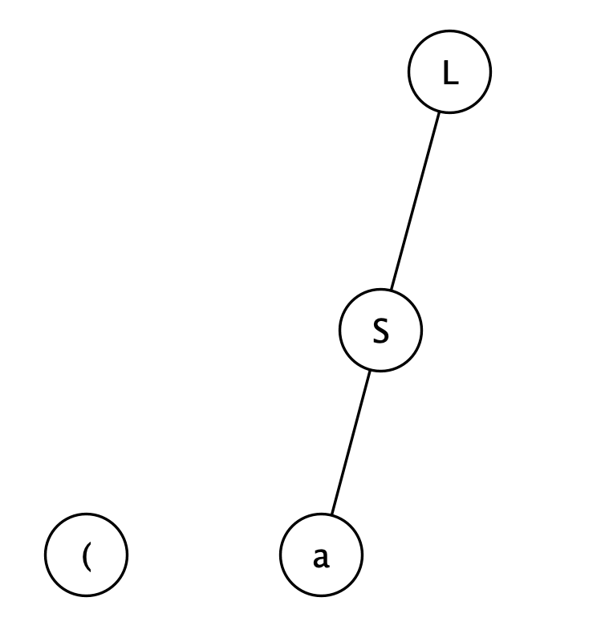  
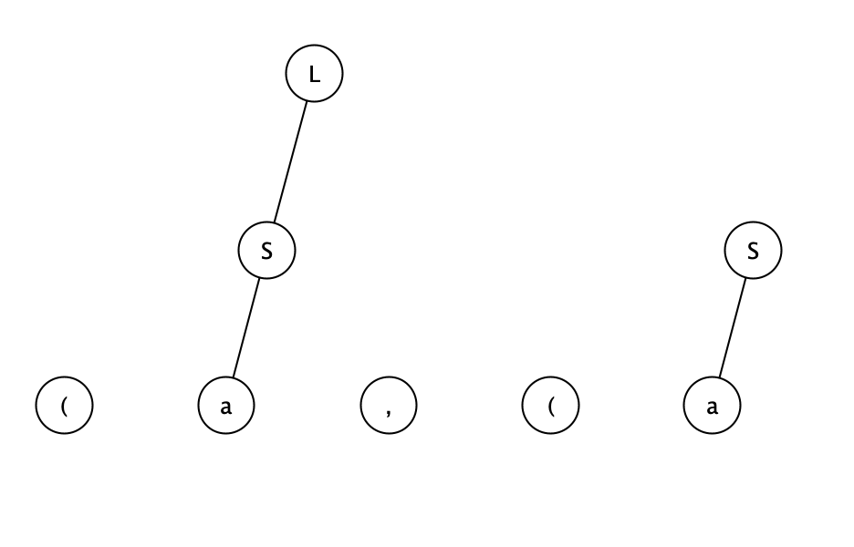  
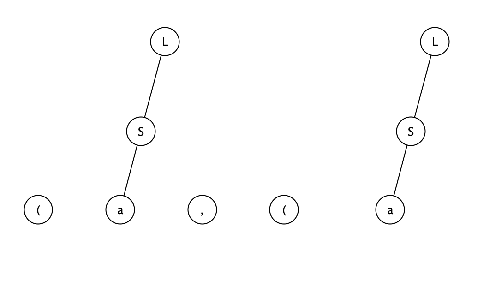  
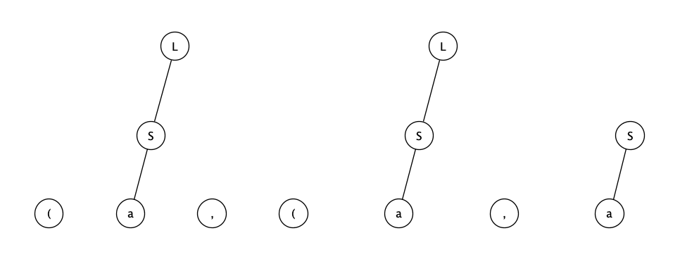  
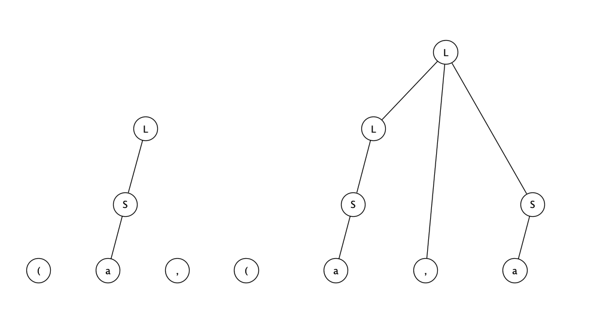  
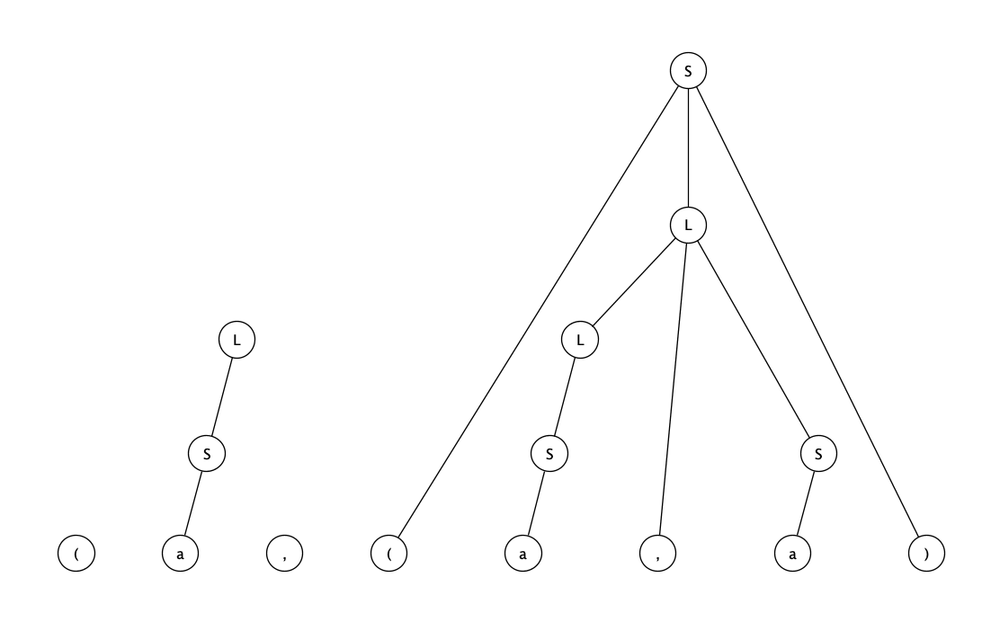  
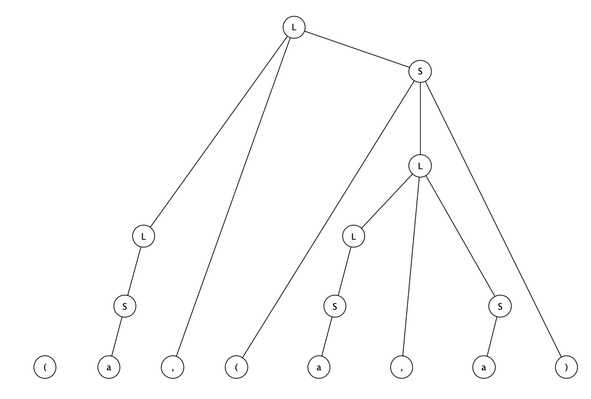  
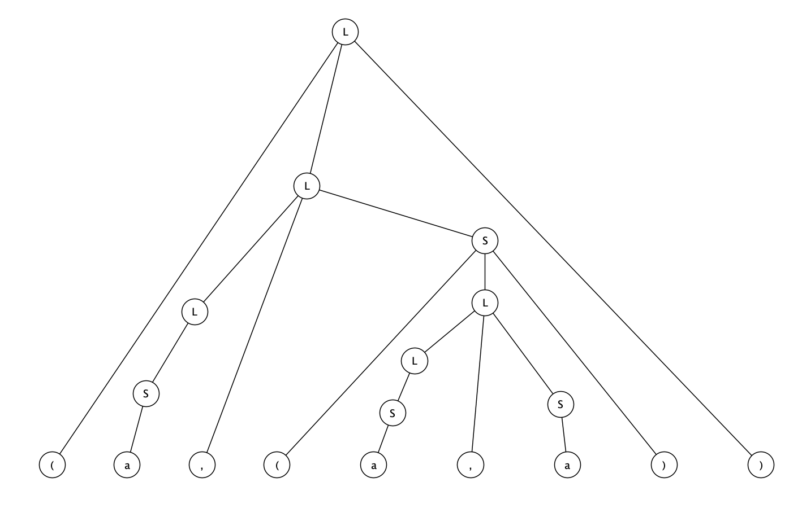  
  

