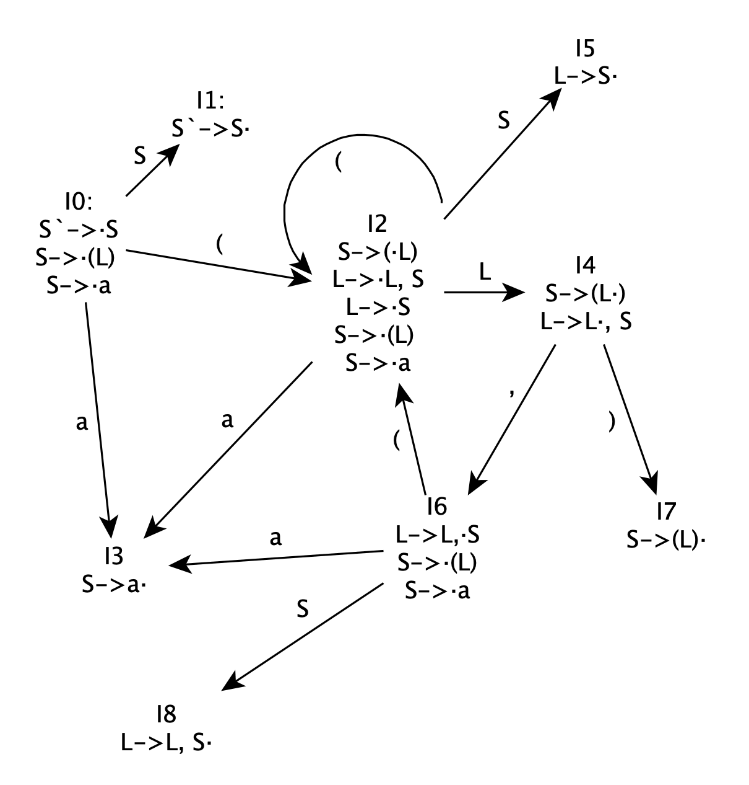
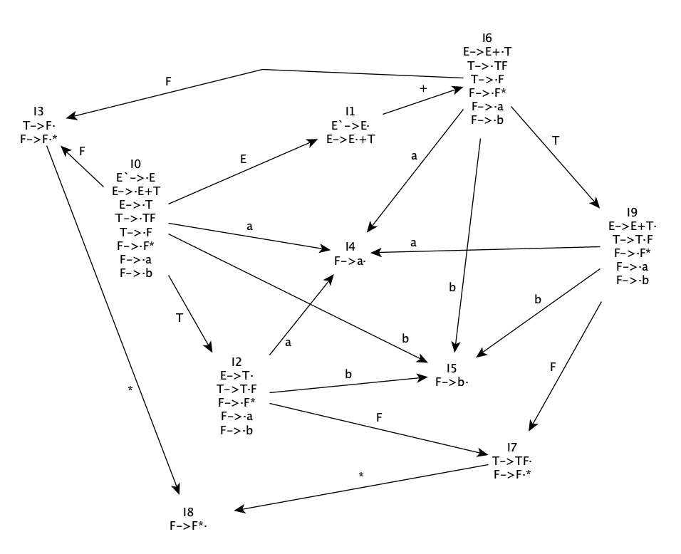
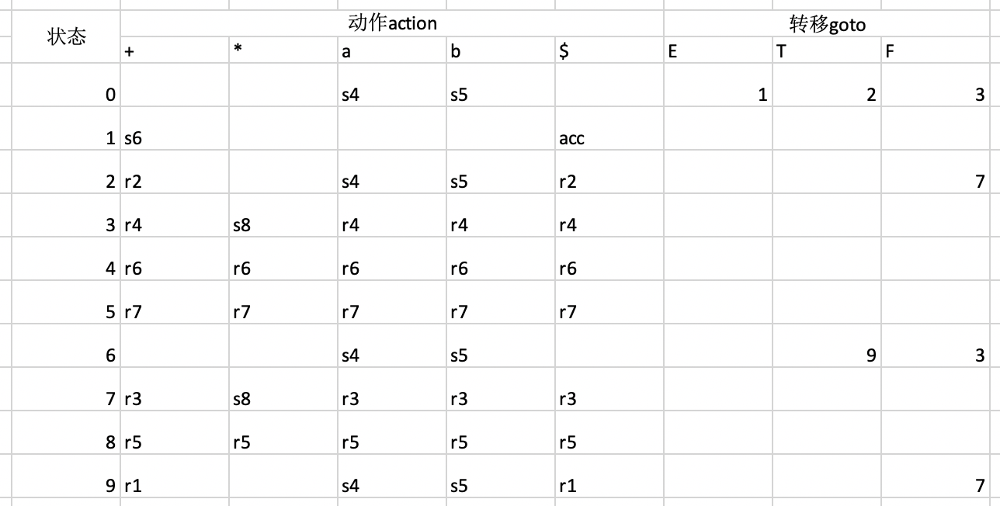

# 9.23
Chap3 3.16
## 3.16
(a)  
最右推导：  
S->*(L)*->(*L,S*)->(L,*(L)*)->(L,(*L,S*))->(L,(L,*a*))-> 
(L,(*S*,a))->(L,(*a*,a))->(*S*,(a,a))->(*a*,(a,a))  
粗体即位句柄  
(b)  
移进规约分析器的步骤：  
  
(c)   
构造分析器的步骤：  
  
  
  
  
  
  
  
  
  

  
# 9.25
Chap3 3.17;3.19 a
## 3.17

## 3.19a
拓广文法
(0)E\`-\>E  
(1)E-\>E+T      
(2)E-\>T  
(3)T-\>TF  
(4)T-\>F  
(5)F-\>F\*  
(6)F-\>a  
(7)F-\>b  
识别活前缀的DFA:  

FIRST(E)={a, b}  
FIRST(T)={a, b}  
FIRST(F)={a, b}  
  
FOLLOW(E)={+, $}  
FOLLOW(T)={+, a, b, $}  
FOLLOW(F)={+, a, b, \*, $}  
  
SLR分析表：  

