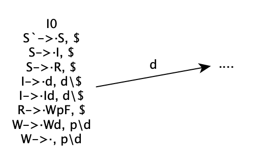

# 9.30
Chap3  3.21a; 3.25; 3.27; 3.29; 3.30  
## 3.21a
根据LL(1)文法的定义：  
S-\>AaAb|BbBa  
A-\>ε  
B-\>ε
FIRST(AaAb)交FIRST(BbBa)集合为空集，且两个串无法推导出空串。满足LL(1)文法的定义  
  
而FOLLOW(A)=FOLLOW{B}={a, b} 
任何句子在面临第一个符号时需要规约空的字符串，所以无法判定将ε规约成A还是B，会发生规约-规约冲突，故不是SLR(1)文法  

## 3.25
由该文法可以得到，L所表示的串是以a开头，后面全部跟着是b的字符串  
可以知道，a之后有n个b字符，则有n个空串归约为M  
但是当读到a字符时，无法确定a之后有多少个b字符串，因此无法确定到底归约多少个M  
因此当读入一个字符之前的所有状态会有“移进/归约”冲突，无法确定到底是移进a还是归约M  
所以开始状态所到达的经过M的状态均会有冲突  
  
所以项目集I0、I1、I2会有移进归约冲突，该文法不是LR(1)文法  

## 3.27
(a):  
d表示任意数字  
则F表示浮点数的小数部分    
W表示浮点数的整数部分   
R表示小数(浮点数)  
I表示整数  
S表示整数或者浮点数   
(b)：  
该文法不是LR(1)文法  
从该文法的描述我们可以看出，只有当我们读到小数点才可以确认为小数或者浮点数  
而从LR(1)分析表中我们可以看出有移进归约冲突  
  
可以看到条目“I->·d, d\$”和条目“W->·, p\d”存在冲突  

## 3.29
(a):  
  

(b):  
有四对同心项目集(已在图中用不同颜色标出)：
  
合并后没有动作冲突  

## 3.30
该文法表示一个空串或者是以a开头的“字符b的数量不比a多”的一个ab字符串  
S —> aLbL  
L —> aT  
T —> S | \epsilon  

