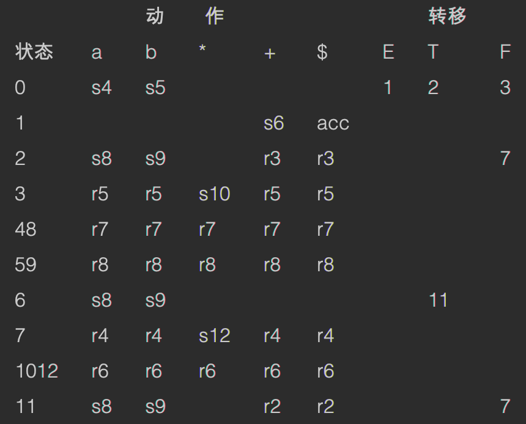
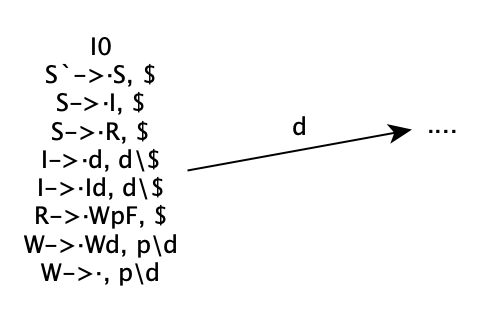
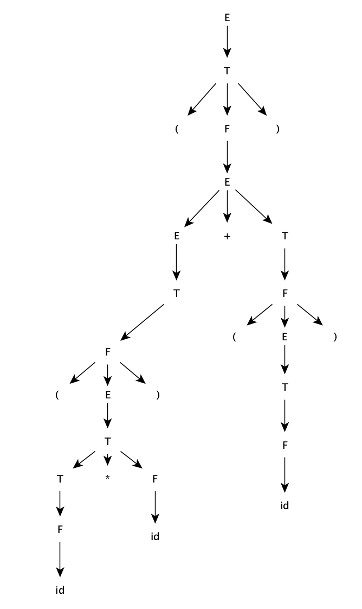
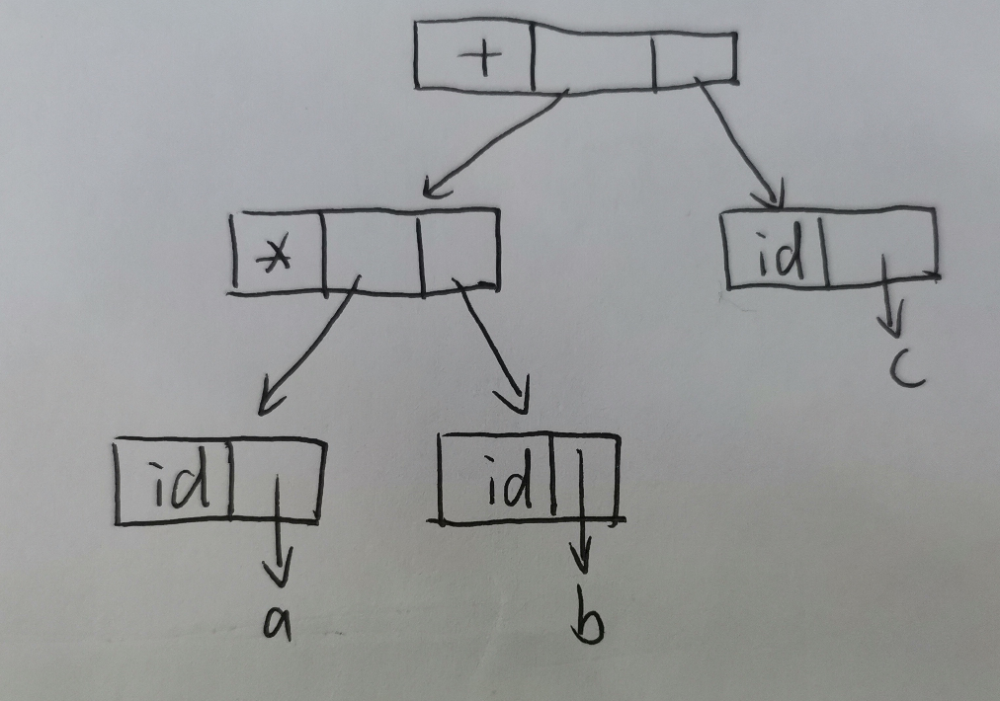
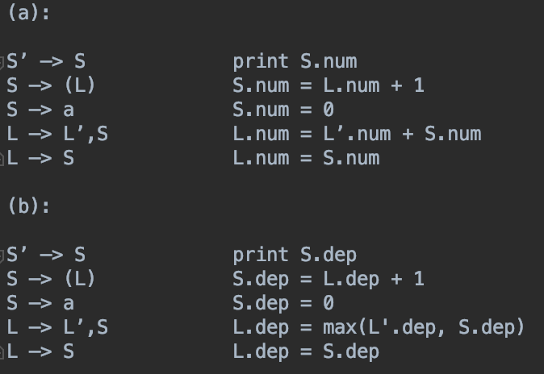
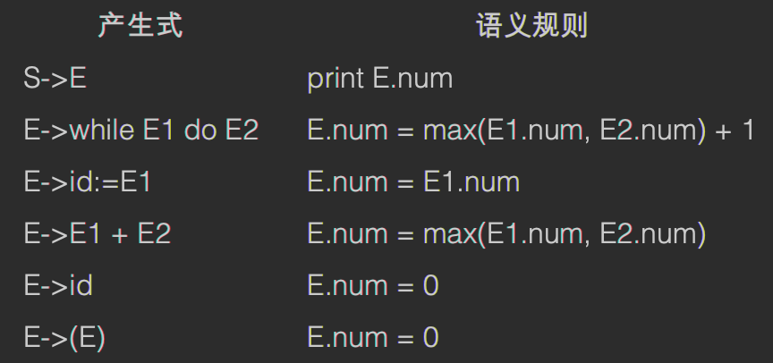
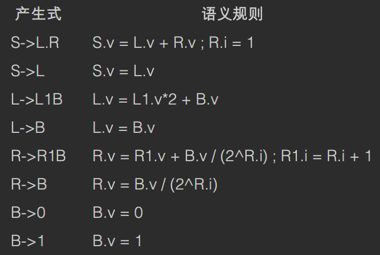

# 10.9
Chap3  3.19 b, 3.24 , 3.27   
## 3.19 b
根据算法画出LR(1)状态转化图后，合并同心项目集即可得到LALR分析表  
  

## 3.24
显然该文法仅含有4个句子，用LR(1)文法很清楚d归约成A还是B  
但是当同心项目集合并之后，会产生归约-归约冲突：  
{  
[A-\>d·, a/c]  
[B-\>d·, a/c]  
}  

## 3.27
(a):  
d表示任意数字  
则F表示浮点数的小数部分    
W表示浮点数的整数部分   
R表示小数(浮点数)  
I表示整数  
S表示整数或者浮点数   
(b)：  
该文法不是LR(1)文法  
从该文法的描述我们可以看出，只有当我们读到小数点才可以确认为小数或者浮点数  
而从LR(1)分析表中我们可以看出有移进归约冲突  
  
可以看到条目“I->·d, d\$”和条目“W->·, p\d”存在冲突  

# 10.12
Chap4 4.2a、4.3、4.5 例题3  
## 4.2a
语法树：  

分析树：  
  

## 4.3

## 4.5

## 例题3
思路：
.的左边不需继承属性，直接L.v = L‘.v\*2 + B.v
.的右边R的继承属性R.i表示距离. 的距离 
最后S.v = L.v + R.v

