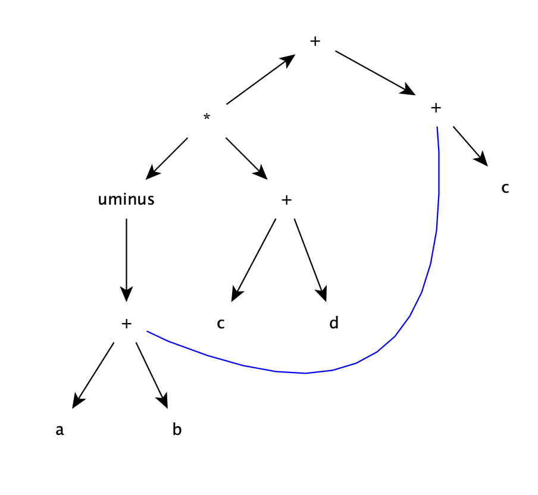
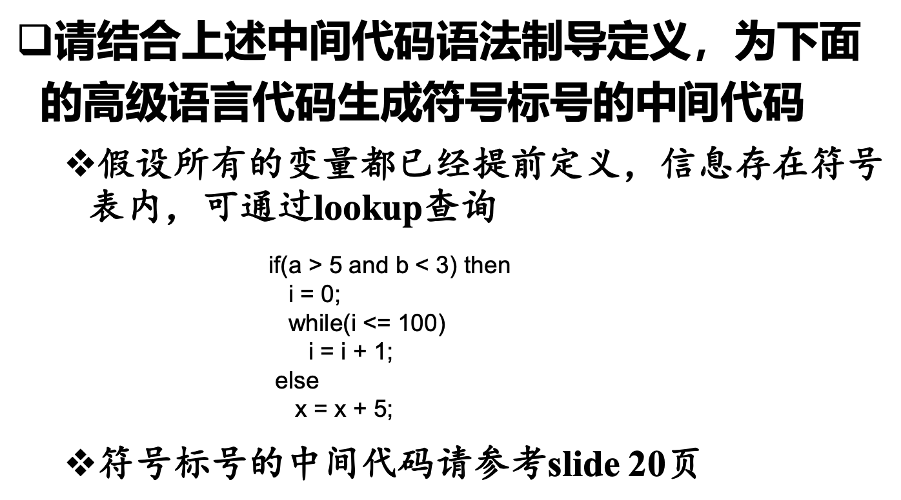

Chap7  7.1 b d;  
## 7.1
b:有向无环图  
    
  
d:三地址代码  
<pre>
t1 = a + b   
t2 = - t1     
t3 = c + d  
t4 = t2 * t3  
t5 = t1 + c  
t6 = t4 + t5  
</pre>
   
<pre>
    t1 = lookup(a.lexeme)  
    t2 = lookup(b.lexeme)  
    if t1 > 5 goto L1  
    goto E1 
L1: if t2 < 3 goto L2
    goto E1
L2: t3 = 0
PD: if t3 <= 100 goto LO   //判断while循环的条件
    goto E2                //不成立，结束
LO: t3 = t3 + 1            //成立，i = i + 1
    goto PD                //继续判断（PD）循环条件
E1: x = x + 5              //if条件不成立
E2: .....                  //代码的后续部分
    .....   
</pre>

