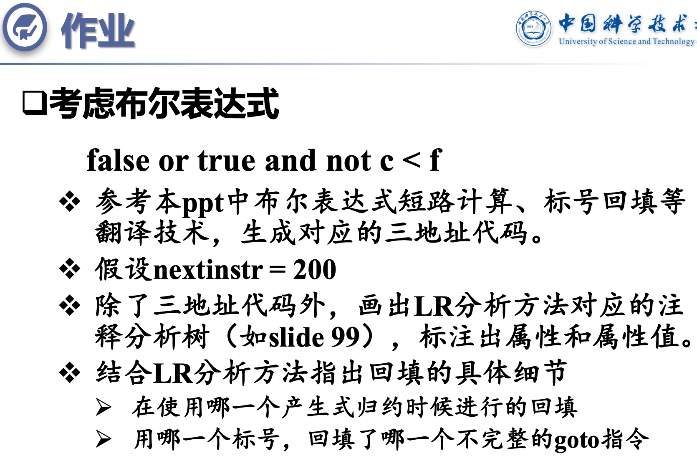
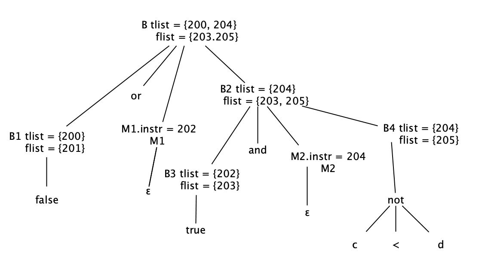

  
三地址代码段：
<pre>
(200) if false goto -
(201) goto -
(202) if true goto -
(203) goto -
(204) if c < f goto -
(205) goto -
</pre>  
  
LR注释分析树：  
  
    
回填的具体细节：  
在使用产生式"M1 -\> ε "归约时产生回填，用标号"202"回填了(201)  
在使用产生式"M1 -\> ε "归约时产生回填，用标号"204"回填了(202)  
<pre>
(200) if false goto -
(201) goto - 202            //202回填(201)
(202) if true goto - 204    //204回填(202)
(203) goto -
(204) if c < f goto -
(205) goto -
</pre>  

